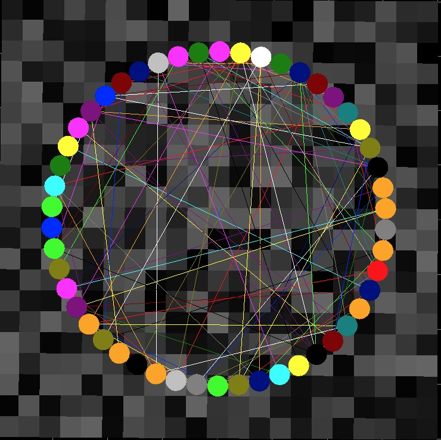
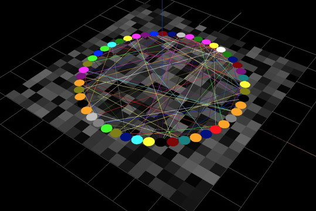

# AgentScript

> A next-generation (es6, Modules, webgl) JavaScript Agent Based Modeling
([ABM](https://en.wikipedia.org/wiki/Agent-based_model)) library.

> Inspired by [NetLogo](https://ccl.northwestern.edu/netlogo/). Fueled by [Three.js](https://threejs.org/). Nudged by [SimTable](http://www.simtable.com/)

## What is it?

ABM is a tool for Complex Adaptive Systems ([CAS](https://en.wikipedia.org/wiki/Complex_adaptive_system)) modeling.

* **Complex**: Highly interactive collection of diverse components,
* **Adaptive**: Time evolving, with interactions informing the evolution,
* **System**: Many dynamic parts with emergent, unpredictable behavior.

An ABM provides a model of a CAS. It has "agents", generally called "turtles", which interact both with themselves and a "patches" world, along with "links" between the turtles. Each can have further subsets called "breeds".

(The name _turtles_ is from [Seymour Papert's Logo language](http://el.media.mit.edu/logo-foundation/what_is_logo/logo_primer.html).)

## ABM models: Space, Time, interaction

The patches, turtles and links live in a world with space, time and interaction:

* **Space**: A world/space defined by a grid of patches or a network of links.
* **Time**: The system evolves by taking steps in time via the step() method.
* **Interaction**: The patches, turtles, and links interact with each other each step.

The evolution over time is managed by an Animator which calls the model's step() function. This method is the main part of your model.

The patches, turtles and links are:

* **Patches**: A grid of squares which contain data and which form the coordinate system.
* **Turtles**: Mobile objects which read/write to patches and interact with each other.
* **Links**: A graph or network formed of turtle nodes.

Here's a picture of all three: dark gray patches, circular turtles, colored links: <br />


And in 3D: <br />


## Getting started: index.html

Before we write a few models, we create an index.html which uses a query string with the name of the model to run: [index.html](https://github.com/backspaces/asx/blob/master/docs/tutorial/index.html) If the tutorial folder is `path/to/tutorial` then `path/to/tutorial?hello` runs the script tutorial/hello.js.

It looks like this:
```html
<script type="module">
  import util from 'http://backspaces.github.io/asx/dist/AS/util.js'

  const app = document.location.search.substring(1) || 'hello'
  const loc = `./${app}.js`
  console.log('running:', loc)
  document.title = app

  util.setScript(loc, {type: 'module'})
</script>
```
The script:
* imports a utility module
* It sets `app` to the query string (?xxx) defaulting to 'hello'
* It sets `loc` to a relative url from `app`
* It prints `loc` to the console and sets the document title to `app`
* Finally it runs the `loc` script as a module

Note that we use es6 Modules which are currently available in Chrome Canary and Safari. Other browsers will be Module-ready the time you read this. AgentScript is currently a dual build, see [models/index.html](https://github.com/backspaces/asx/blob/master/models/index.html)
for how to run in legacy script mode.
