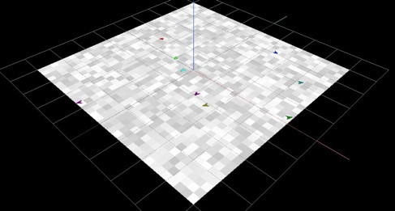
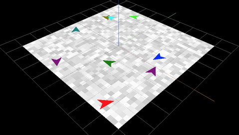

# Class Model

Before we write our first model, we need to understand Class Model which integrates AgentScript's es6 Modules into an easy to use framework. (This is not required, the Modules can be used as a stand-alone ABM library. More later)

There are three main parts to building a Model:
* Subclassing Class Model
* Providing two abstract methods: `setup()` and `step()`
* Instantiating the model with the required three options
  * The model's div. Default: document.body
  * The model options. Default: PatchSize=13, MinX/Y, /MaxX/Y = +/-16 patches
  * The renderer options. Default: THREE.js meshes for patches, turtles, links

For now we'll simply use the defaults.

## Hello World model: hello.js

Next, we create our first model, [hello world](tutorial/?hello).



It looks like this:
```javascript
import {ColorMap, Model, util} from 'http://backspaces.github.io/asx/dist/AS.module.js'

class Hello extends Model {
  setup () {
    this.patches.ask(p => {
      p.color = ColorMap.LightGray.randomColor()
    })

    this.turtles.setDefault('atEdge', 'bounce')
    this.turtles.create(10, t => {
      const patch = this.patches.oneOf()
      t.setxy(patch.x, patch.y)
    })
  }
  step () {
    this.turtles.ask(t => {
      t.direction += util.randomCentered(0.1)
      t.forward(0.1)
    })
  }
}
const model = new Hello()
model.start()
util.toWindow({ ColorMap, Model, util, model })
```

## Importing AgentScript modules
The first line imports the modules we need from AS.module.js. This is a [Rollup](https://rollupjs.org/) of all our individual modules. In this case we use three: ColorMap, Model, and util.

```javascript
import {ColorMap, Model, util} from 'http://backspaces.github.io/asx/dist/AS.module.js'
```

We could have imported the modules individually instead (as we did for `util` in the index.html script):
```javascript
import ColorMap from 'http://backspaces.github.io/asx/dist/AS/ColorMap.js'
import Model from 'http://backspaces.github.io/asx/dist/AS/Model.js'
import util from 'http://backspaces.github.io/asx/dist/AS/util.js'
```

## Subclassing class Model

We then write a subclass of class Model, supplying two "abstract" methods, setup and step:

```javascript
class Hello extends Model {
  setup () { ... }
  step () { ... }
}
```

The `setup()` method is called when your model starts. It is where you initialize your patches, turtles and links.

The `step()` method is called each 'tick' of your model. It is called by the `model.anim` Animator class instance initialized by the Model constructor. The default is to call your step function 30 times per second, but you can change that in `setup()` if you wish.

## Initializing and running a Model

After you define your Hello subclass of class Model, you "insatiate" via `new Hello()`. Then you use the `start()` method to begin animating.

```javascript
const model = new Hello()
model.start()
util.toWindow({ ColorMap, Model, util, model })
```

For debugging and looking at parts of the model, we use `util.toWindow` to copy the modules and our model to window, printing a message in the console. (Modules are isolated from the global scope.)

## Setup:

Our setup() method has two parts, setting up the patches then the turtles.

```javascript
setup () {
  this.patches.ask(p => {
    p.color = ColorMap.LightGray.randomColor()
  })

  this.turtles.setDefault('atEdge', 'bounce')
  this.turtles.create(10, t => {
    const patch = this.patches.oneOf()
    t.setxy(patch.x, patch.y)
  })
}
```

The patches are created in Model's constructor given the world parameters, which are defaulted to be: patch size is 13x13, centered in a square with "radius" of 16 patches. That's a total of 33 x 33, or 1089 patches.

Because the patches are already created, we just `ask` them all to color themselves a random light gray color. `ask` is simply an iterator over all the patches executing a function on each.

For the turtles, we first tell them to "bounce" when they reach an edge. We do this by setting a default for *all* turtles. We could equally tell each turtle to do so, but defaults are shared amongst all the turtles and thus can be changed with a single setting. This is explained in depth in this [Medium story](https://medium.com/dailyjs/two-headed-es6-classes-fe369c50b24).

Finally, we create 10 turtles, initializing them with the function passed in. This function first finds a random patch, then sets the turtle's coordinates to the patch's.

## Step:

The step() function is pretty simple: the turtles randomly change their direction by a random float in [-0.1, 0.1], and move forward by 0.1 patch size units, in this case 0.1 * 13 (13 is the default patch size).

```javascript
step () {
  this.turtles.ask(t => {
    t.direction += util.randomCentered(0.1)
    t.forward(0.1)
  })
}
```

## Using the console

At this point, your model is running. The console is useful for inspecting the model and its parts, and interacting with it.

In the window/tab [the model](tutorial/?hello) is running, open the console .. ctl-j for Chrome/Canary, ctl-c for Safari. Or use the menus.

Lets look at the patches, turtles, and links:
`let {patches, turtles, links} = model`

Then, one at a time, type `patches`, `turtles`, `links`.

To look at individual patches and turtles, this will give you a random one of each:
`let [p, t] = [turtles.oneOf(), patches.oneOf()]`

We can be more dynamic too. To make the turtles 3 patches in size:
`turtles.setDefault('size', 3)`


Use these for different edge behavior:
`turtles.setDefault('atEdge', 'clamp')`
`turtles.setDefault('atEdge', 'wrap')`
